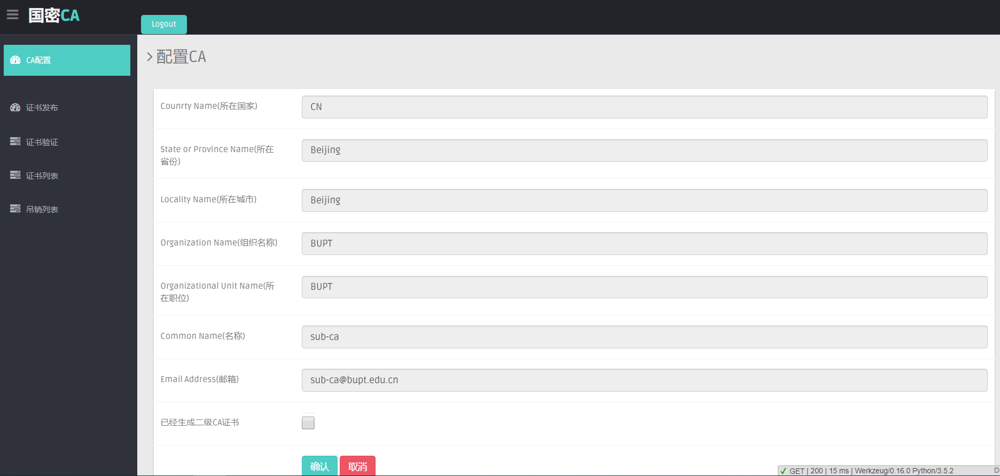
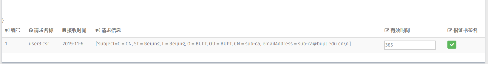
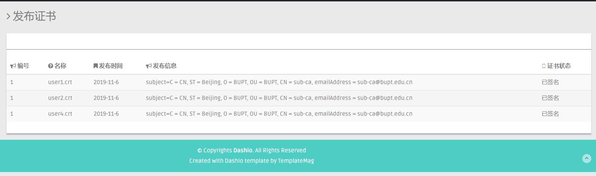

# ReadMe

### 系统目录

```sh
CA_system: 项目总目录
	CA: 根CA目录
		certs: 证书文件夹
		newcerts: 新生成的证书文件夹
		crl: 吊销证书文件夹
		csr: 证书请求文件夹
		db: 证书操作数据库
		private: 私有信息存储
		root-ca.conf: 根ca配置文件
		root-ca.crt: 根ca证书
		root-ca.csr: 根ca证书请求
		ca.sh: 根CA签名sh
	sub_CA: 二级CA总目录
		static: flask web css/js文件夹
		templates: flask web html文件夹
		sub-ca.conf: sub-ca配置模板文件
		CA.py:	CA系统运行代码
		sub_ca_admin: 为admin二级CA生成的子目录
			certs: 证书文件夹
			newcerts: 新生成的证书文件夹
				生成的证书命名格式：时间+名称.crt
			crl: 吊销证书文件夹
			csr: 证书请求文件夹
				证书请求命名格式： 时间+名称.csr
			db: 证书操作数据库
			private: 私有信息存储
				sub-ca.key:	sub-ca私钥
			sub-ca.conf: sub-ca配置文件
			sub-ca.crt: sub-ca证书
			sub-ca.csr: sub-ca证书请求
```

### 系统环境

```
操作系统: ubuntu
语言: python3
openssl: 已配置为系统参数
web框架: flask
数据库:
```

## CA

系统初始化时会生成一个根CA，该CA是离线的，由根CA对二级CA(sub_CA)发布证书，二级CA在对各用户发布证书。

CA 主要需要实现的功能有：二级CA申请（包括私钥加密的密钥，CA信息），对用户证书请求签名，吊销证书（并存储到吊销数据库），证书列表（并对列表里的所有证书进行备份）。

CA系统只有二级CA管理员能够进入。

#### 根CA

根CA已经配置完成，除了生成二级 CA需要使用之外，基本上不会对其操作。

ca.sh 是对 二级CA 的证书请求 进行签名的 bash脚本。

#### sub-CA

**sub-ca 配置**

sub-CA 是对CA管理员的操作，运行 CA.py 进入管理界面。sub-ca 的账号需从数据库中添加。

第一次登录的 sub-ca 后台会自动为其生成工作目录，例如 admin登录，后台在sub_CA目录下生成 sub_ca_admin目录，admin的所有文件都在sub_ca_admin下生成。

初次登录的 sub-ca 会要求 生成 SM2公私钥（sub-ca.key) 和 建立证书请求（sub-ca.csr)。该请求将会由线下提交到 根CA，由其对 sub-ca.csr 进行签名，再线下传输到sub-ca服务器中。

sub-CA 配置成功后，即可显示以下界面，显示配置信息和提示已生成二级CA证书（sub-ca.crt)。



**sub-ca 发布证书**

sub-ca接受到用户从客户端提交的证书请求（该请求保存在 csr文件夹下）后，在证书发布界面中即可看到。在该界面管理员可对证书进行签名发布，配置有效时间。



生成的证书被保存到 newcerts目录下。

所有发布的证书都将会被存储到数据库中。

**sub-ca 显示证书列表**

从“证书列表”  界面，可以看到当前已经发布的证书。

目前采取从 newcerts 文件夹下读取 文件，以后可以采取从数据库中读取数据显示证书列表。



#### 需完善功能

1. 将所有操作都与数据库相结合；
2. 

### 数据库说明

#### 证书数据库
(暂定)
* id, int类型, 证书id
* serial_number, text类型, 表示证书的序列号/公钥
* state, int类型, 表示证书的状态，预定0表示证书吊销，1表示证书正常，2表示证书过期
* create_date, DATE类型, 证书的创建日期
* effective_time, int类型, 表示证书的有效期, 年为单位
* country, province, city, organization, name等为text类型
* email为text类型

#### 吊销证书数据库

* id, int类型, 证书id
* serial_number, text类型, 表示证书的序列号/公钥
* state, int类型, 表示证书的状态，预定0表示证书吊销，1表示证书正常，2表示证书过期
* create_date, DATE类型, 证书的创建日期
* effective_time, int类型, 表示证书的有效期, 年为单位
* destroy_date, DATE类型, 表示证书的吊销日期
* country, province, city, organization, name等为text类型
* email为text类型


## Client

Client 需要实现的功能有：证书请求生成，获取证书列表，吊销证书。

Client和二级CA之间需要有通信实现证书的传输。

## OpenSSL

OpenSSL 1.1.1 版本支持国密，不过经过我验证生成的证书仍然是基于 Sha256的，生成国密证书这里可能还需要调研。
